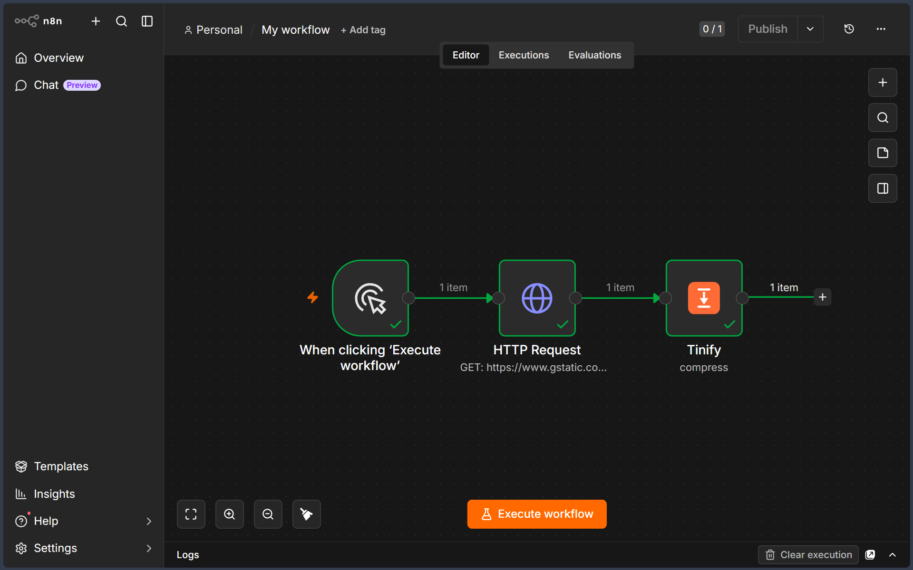

# n8n-nodes-tinify

This is an n8n community node. It lets you use Tinify (TinyPNG) in your n8n workflows.

Tinify is an image optimization service that compresses PNG, JPEG, WebP, and AVIF files — often by 50–80% — using smart lossy compression techniques.

[n8n](https://n8n.io/) is a [fair-code licensed](https://docs.n8n.io/sustainable-use-license/) workflow automation platform.

[Installation](#installation)  
[Operations](#operations)  
[Credentials](#credentials)  
[Compatibility](#compatibility)  
[Usage](#usage)  
[Resources](#resources)  
[Version history](#version-history)  

## Installation

Follow the [installation guide](https://docs.n8n.io/integrations/community-nodes/installation/) in the n8n community nodes documentation.

## Operations

- **Compress** — Shrink a PNG, JPEG, WebP, or AVIF image to the smallest possible size.
- **Resize** — Resize an image using one of four methods: Scale, Fit, Cover, or Thumb. Each resize counts as one additional compression against your monthly quota.
- **Convert** — Convert an image to a different format: WebP, PNG, JPEG, AVIF, or let Tinify automatically choose the smallest output. Counts as one additional compression.

## Credentials

1. Go to [tinify.com/developers](https://tinify.com/developers) and enter your email address.
2. Check your inbox and click the link Tinify sends you.
3. Your API key is shown on the dashboard.
4. In n8n: open **Credentials → Add credential**, search for **Tinify API**, paste your key into the **API Key** field, and click **Save**.

The free tier allows 500 compressions per month. Paid plans are available at [tinify.com/pricing](https://tinify.com/pricing).

## Compatibility

Tested against n8n ≥ 1.0.0 and n8n-workflow ≥ 2.0.0.

## Usage

- Connect this node after any node that produces binary image data — for example, an **HTTP Request** node with **Response → File** enabled, or a **Read/Write Files from Disk** node.
- **Input Binary Field** and **Output Binary Field** both default to `data`. Only change these if your workflow uses a different field name.
- The `compressionCount` value in the JSON output shows how many of your monthly compressions have been used so far.
- For **Resize → Scale**, provide either width or height — not both. All other resize methods require both values.

## Example workflow

A ready-to-run example lives in [`workflows/tinify-compress-example.json`](workflows/tinify-compress-example.json). It downloads a sample JPEG and compresses it with Tinify.

To try it: in n8n open **Workflows → Import from File**, select the JSON, then open the **Tinify** node and pick your Tinify API credential before running.

## Resources

- [n8n community nodes documentation](https://docs.n8n.io/integrations/community-nodes/)
- [Tinify API documentation](https://tinify.com/developers/reference)
- [Tinify pricing & plans](https://tinify.com/pricing)

## Version history

**0.1.1** — Convert now renames the output file extension to match the new format; resize dimensions are validated before upload so an invalid request no longer uses a compression.

**0.1.0** — Initial release. Compress, Resize (Scale / Fit / Cover / Thumb), and Convert (WebP / PNG / JPEG / AVIF) operations.
